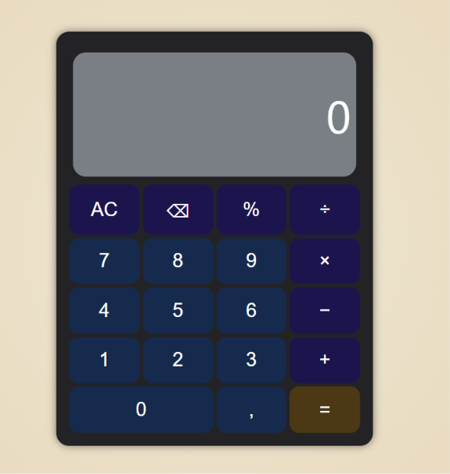

# Calculadora Básica

Calculadora web simples feita usando vanilla HTML5, CSS3 e JS.

Esta calculadora foi feita como um _begginer project_ para aprender os básicos de _DOM manipulation_,
_CSS styling_ e _event handling_.

## Features

- **Aritimética básica**: Cálculos simples como adição, subtração, multiplicação e divisão
- **Apagar e/ou Clear**: Botão para deletar o último número ou `AC` para limpar toda a tela
- **Porcentagem**: Botão especializado para converter números em suas respectivas porcentagens
- **Suporte para números decimais**: Permite e realiza cálculos com números _float_

## Screenshot

## Feito com

- HTML5: Estrutura semantica para os botões e o display
- CSS3: Estilização do layout e design
- JavaScript: _Event handling_ dos botões e controle do display

## Como utilizar localmente

Já que este projeto foi feito utilizando HTML e JS, não é necessário instalar nenhuma dependência.